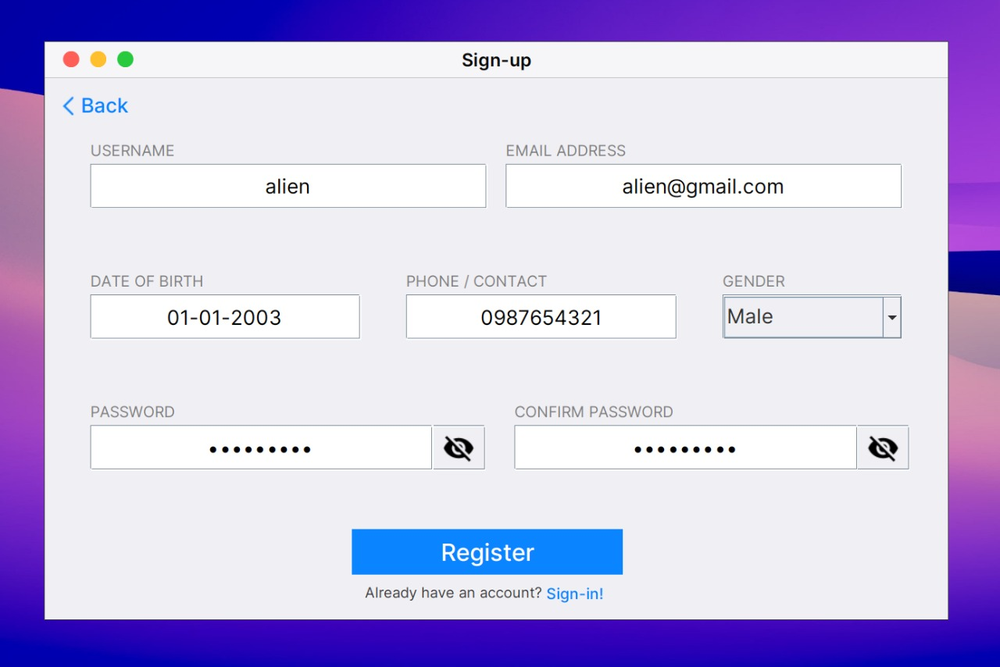
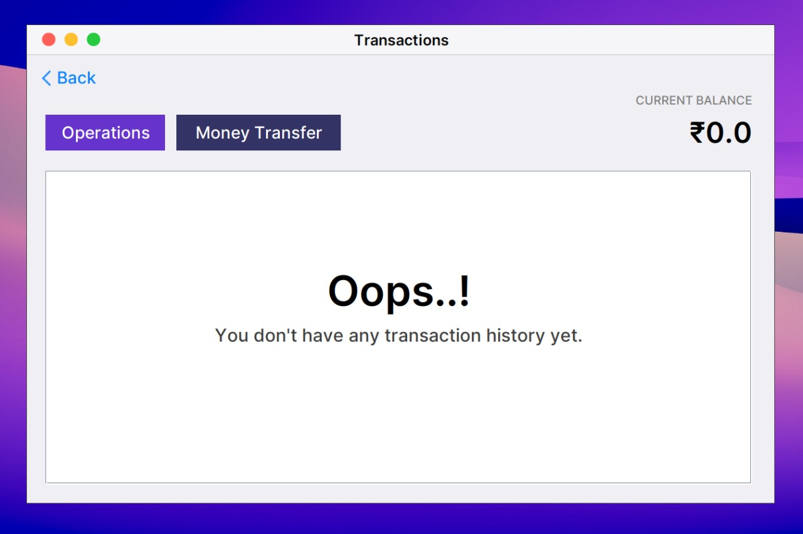

# Desktop-MyBank

## Overview

Welcome to `Desktop-MyBank`! This Java Swing application helps you manage user transactions in a simple and straightforward desktop environment. Whether you need to deposit or withdraw money, manage user accounts, or check transaction histories, `Desktop-MyBank` has you covered. The application is built with Java 17 and uses Maven for dependency management.

## Screenshots

Here’s a glimpse of what the application looks like:

### Demo Walkthrough

Check out the full application in action:
*https://youtu.be/agP1lba8UZU*

*Note: Modals/Popups are not visible in the above demo.*

### Heads Up: MySQL Connection

Make sure your MySQL server is running smoothly:

## What You'll Need

To get started, make sure you have the following:

- **Java 17**: The application runs on Java 17.
- **MySQL Database**: You’ll need MySQL installed and configured.
- **Maven**: For building the project and managing dependencies.

The app uses `mysql-connector-java` to connect to the MySQL database and `lombok` to keep the code clean and concise.

## Key Features

- **Easy Transaction Management**: Deposit, withdraw, and review transaction histories with ease.
- **User Management**: Add, update, or remove user accounts quickly.
- **Detailed Transaction History**: Get a clear view of all transactions in a simple table format.

## Getting Started

1. **Run the Application**: Compile and run the `Desktop-MyBank` JAR file using Java 17.
2. **Manage Transactions**: Use the user-friendly interface to handle deposits, withdrawals, and view transaction logs.
3. **Manage Users**: Effortlessly add, update, or delete user accounts.

## Contributing

We welcome contributions! If you have improvements or fixes, feel free to fork the repository and submit a pull request.

## License

This project is open-source and available under the MIT License.

---
